<div align="center">

<br/>

# AlgoRhythm
### 규칙 및 전략 기반 인력 운영 최적화를 위한 지능형 스케줄링 웹 플랫폼

<br/>

[](https://react.dev)
[](https://vitejs.dev)
[](https://spring.io/projects/spring-boot)
[](https://www.mysql.com)
[](https://redis.io)

[](https://www.docker.com)
[](https://www.anthropic.com)
[-412991?style=flat-square&logo=openai&logoColor=white)](https://openai.com)

<br/>

> **2026 이화여자대학교 캡스톤디자인과창업프로젝트**
> **Team 알고리듬**

**[🌍 Live Demo](https://ourschoolschedule.vercel.app/)** · **[📄 API Docs (Swagger)](https://ourschoolschedule.github.io/AlgoRhythm-swagger/)** · **[🤖 AI 투명성 리포트](docs/AI_TRANSPARENCY.md)**

</div>

---

## 📌 Overview

기존 학교 스케줄링 시스템은 유연한 최적화 기능이 부재하여 개인의 선호도와 업무 부담을 충분히 반영하기 어렵습니다. 관리자(교무처장 등)가 엑셀과 수기로 스케줄을 2차 조정하는 과정에서 막대한 행정 리소스가 낭비되며, 단순 순번 배정은 불균형을 유발합니다.

AlgoRhythm은 이러한 문제를 해결하기 위해 데이터와 다중 제약조건(전략) 기반의 **자동 스케줄링 및 시프트 관리 시스템**을 구축하여, 공정한 업무 배정과 교육 행정 효율 향상을 목표로 합니다.

**타겟 사용자:** 학교 스케줄을 관리하는 교사 — 특히 교무처장 등 일정 배정 담당 인력

<br/>

## ✨ Key Features

- **전략 기반 지능형 자동 스케줄링**: 근무자 정보와 필수/선택 제약 조건을 연산하여 최적의 시간표를 자동으로 생성 (향후 휴리스틱 최적화 알고리즘으로 고도화 예정)
- **시간표 대안 제시**: 단일안이 아닌 복수의 시간표 대안을 생성해 관리자의 선택권 보장
- **인터랙티브 캘린더 관리**: 통합 캘린더를 통한 직관적인 스케줄 조회 및 드래그 앤 드롭 형태의 수정 기능 지원
- **긴급 대타 매칭 및 교환**: 결원 발생 시 가용 인원 데이터를 분석하여 최적의 대리 근무자를 추천 및 연결
- **AI 어시스턴트 챗봇**: Anthropic Claude 기반 인앱 챗봇으로 보결 처리·시간표 최적화·제약 조건 설정 등을 자연어로 안내 (※ 자연어 제약조건 자동 파싱은 도입 예정)
- **보안 검증 및 계정 관리**: Google SMTP를 활용한 이메일 인증 및 Redis TTL 기반의 안전한 인증 코드 관리 (※ 현재 무료 배포 환경에서는 SMTP 발송이 제한되며, 로컬/유료 환경에서 동작)

<br/>

## 📸 Screenshots

> 실제 서비스 화면입니다. 더 자세한 흐름은 **[🌍 Live Demo](https://ourschoolschedule.vercel.app/)** 에서 확인할 수 있습니다.

<table>
  <tr>
    <td align="center" width="33%">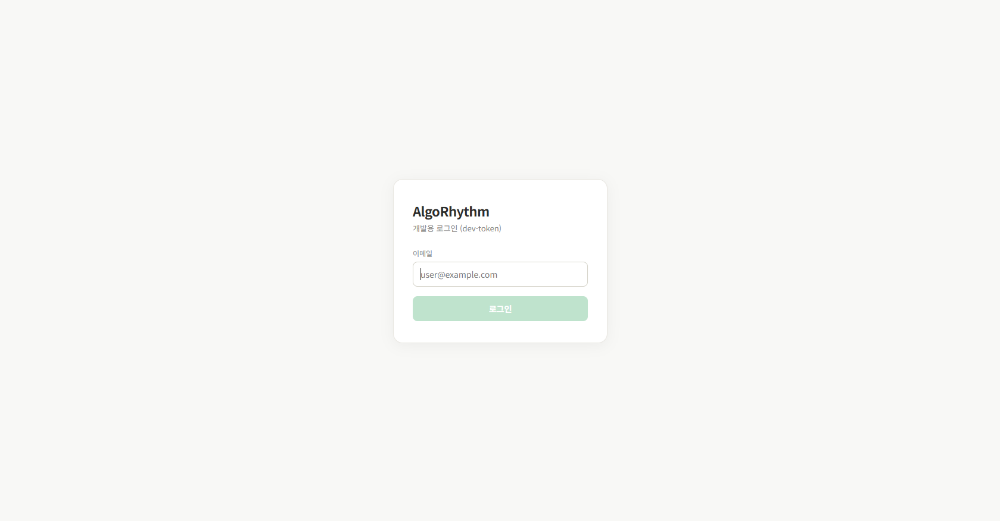<br/><sub><b>로그인</b></sub></td>
    <td align="center" width="33%">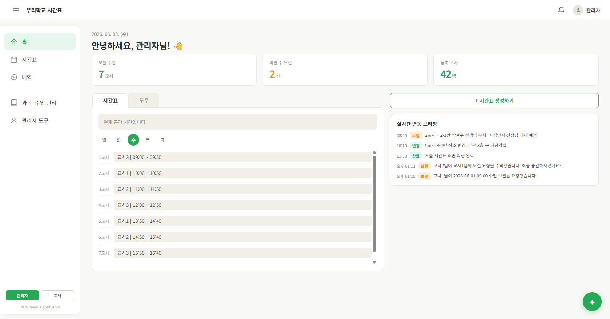<br/><sub><b>홈 대시보드</b></sub></td>
    <td align="center" width="33%">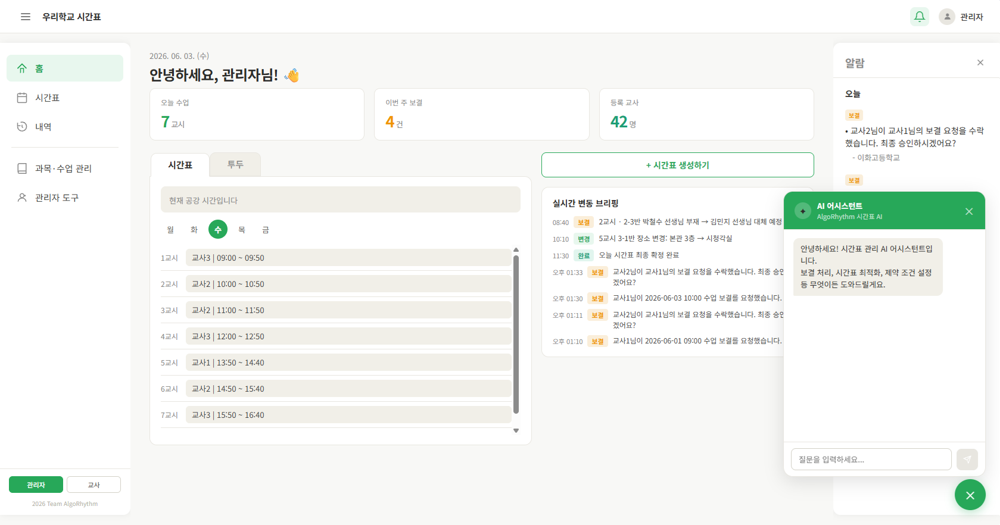<br/><sub><b>AI 어시스턴트 (Claude)</b></sub></td>
  </tr>
</table>

**🗓️ 스케줄 생성 플로우**

<table>
  <tr>
    <td align="center" width="25%">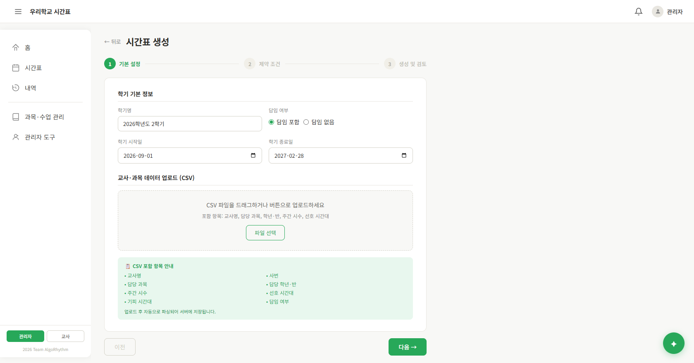<br/><sub>① 기본 설정</sub></td>
    <td align="center" width="25%">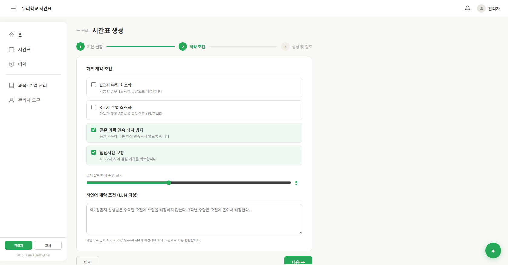<br/><sub>② 제약 조건</sub></td>
    <td align="center" width="25%">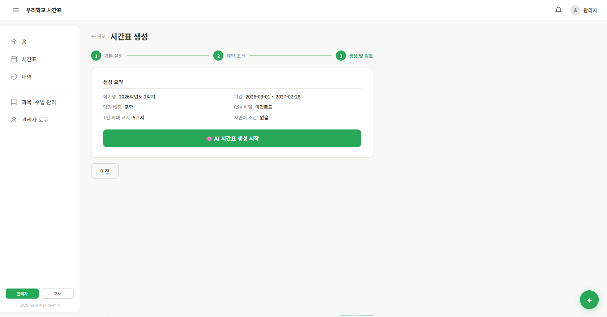<br/><sub>③ 전략 선택</sub></td>
    <td align="center" width="25%">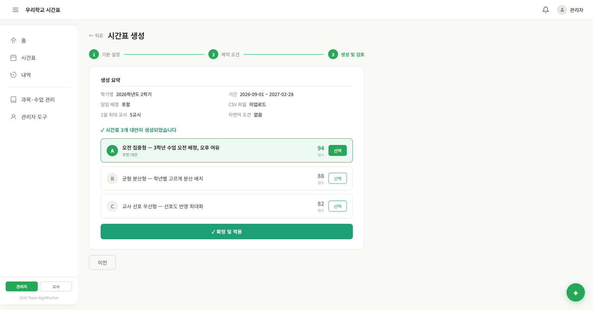<br/><sub>④ 생성 결과</sub></td>
  </tr>
</table>

**🔁 대타(보결) 요청 → 수락 → 최종 승인**

<table>
  <tr>
    <td align="center" width="33%">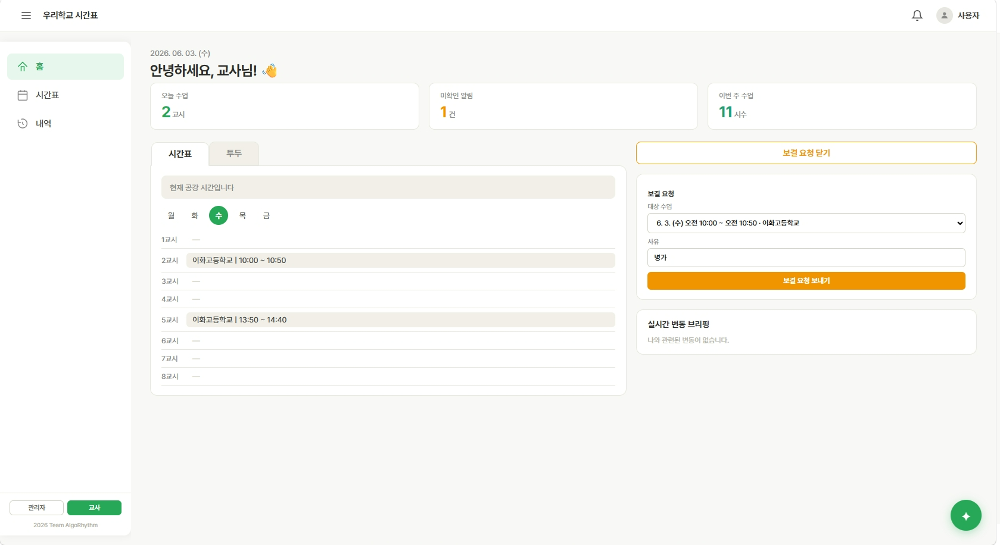<br/><sub>대타 요청</sub></td>
    <td align="center" width="33%">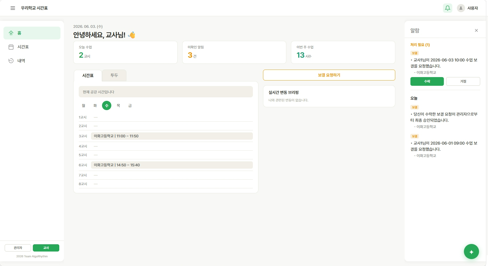<br/><sub>대타 수락</sub></td>
    <td align="center" width="33%">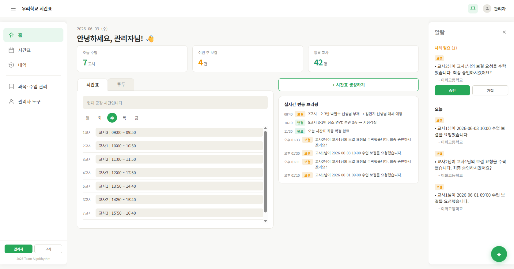<br/><sub>관리자 최종 승인</sub></td>
  </tr>
</table>

<details>
<summary>📂 더 많은 화면 보기 (알림 · 이력 · 관리 · 할 일)</summary>

<table>
  <tr>
    <td align="center" width="25%">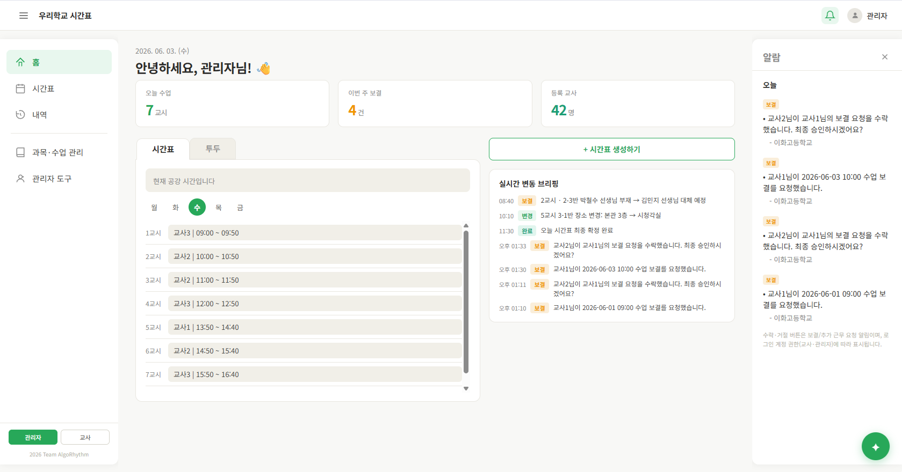<br/><sub>알림</sub></td>
    <td align="center" width="25%">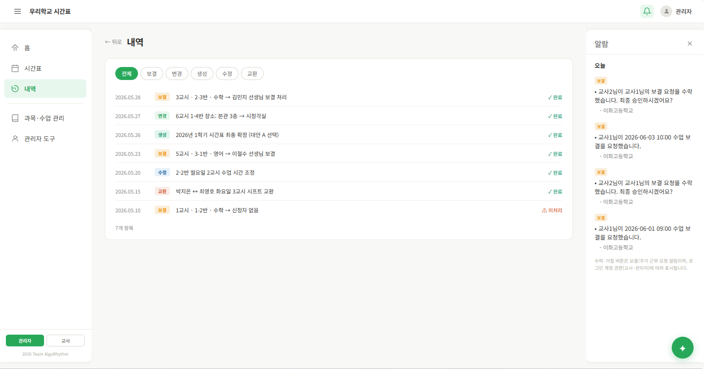<br/><sub>이력</sub></td>
    <td align="center" width="25%">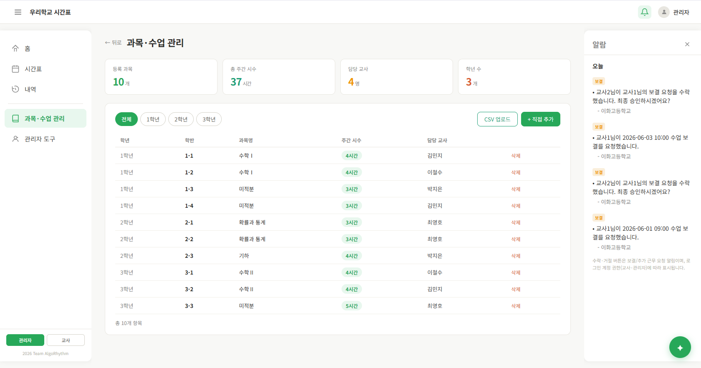<br/><sub>관리</sub></td>
    <td align="center" width="25%">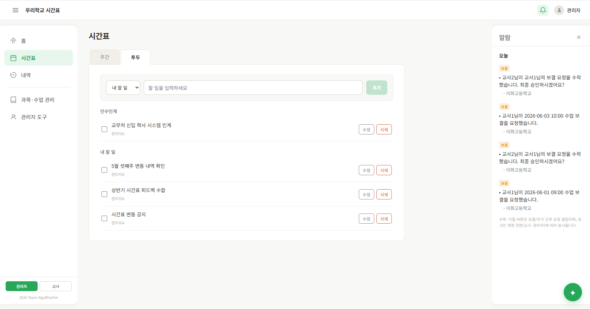<br/><sub>할 일</sub></td>
  </tr>
</table>

</details>

<br/>

## 🏗️ System Architecture

```text
┌──────────────────────────────────────────────────────────────┐
│              Frontend (React + Vite) — Vercel 배포             │
│   인터랙티브 캘린더 UI · 시간표 확인/수정 · 보결/교환 요청 UX        │
│   AI 어시스턴트 챗봇(✦) ──────────────┐ (현재: 클라이언트 직접 호출) │
└──────────────────┬───────────────────┼───────────────────────┘
                   │ HTTPS REST API     │
                   │                    ▼
                   │          ┌────────────────────┐
                   │          │  Anthropic Claude   │
                   │          │  AI 어시스턴트 응답   │
                   │          │ (claude-sonnet-4)   │
                   │          └────────────────────┘
┌──────────────────▼───────────────────────────────────────────┐
│           Backend (Spring Boot 3 + Spring Data JPA)           │
│     인력/스케줄 비즈니스 로직 · 다중 제약조건 검증 · 인증/인가         │
└───────┬───────────────────┬───────────────────────┬──────────┘
        │                   │                        │ (도입 예정)
┌───────▼───────┐   ┌───────▼───────┐       ┌────────▼────────┐
│     MySQL     │   │ Redis (Cache) │       │   OpenAI API    │
│ 인력/스케줄 데이터 │   │ 상태·인증코드 캐싱 │     │ 자연어 제약조건 파싱│
│                │   │  (TTL 관리)    │       │    (도입 예정)    │
└───────────────┘   └───────────────┘       └─────────────────┘
```

> **AI 통합 현황 (솔직한 표기)**
> - **AI 어시스턴트 챗봇**은 현재 프론트엔드에서 **Anthropic Claude API를 직접 호출**합니다. 빠른 프로토타이핑을 위한 구조이며, API Key 보호를 위해 **백엔드 프록시 경유로 이전 예정**입니다([Roadmap](#-roadmap-진행--예정)).
> - **OpenAI 기반 자연어 제약조건 파싱**은 백엔드 연동으로 **도입 예정** 단계입니다(상세: [AI 투명성 리포트](docs/AI_TRANSPARENCY.md)).

<br/>

## 🛠️ Tech Stack

영역별 기술 스택입니다.

| 영역 | 기술 |
| --- | --- |
| **Frontend** | React 19, Vite, React Router, TanStack Query, Axios |
| **Backend** | Spring Boot 3, Spring Data JPA, Spring Security, JWT, JavaMailSender |
| **Database / Cache** | MySQL (인력/스케줄 데이터), Redis (상태 · 인증코드 캐싱, TTL 관리) |
| **AI / LLM** | Anthropic Claude API (AI 어시스턴트 챗봇, 프론트 연동 · 동작 중) · OpenAI API (자연어 제약조건 파싱 · 도입 예정) |
| **Infra / DevOps** | Docker, GitHub Actions (CI/CD), Vercel(FE), AWS EC2·ECR(BE 이전 예정) |
| **API Docs / Test** | Swagger(Springdoc), JUnit5, Vitest, k6(부하 테스트) |

### 기술 의사결정 (Decisions)

* **Infra / Deployment**: Docker 컨테이너화 · Frontend는 **Vercel** 배포 · Backend는 현재 **Railway(무료 요금제)에 한시적 배포**. 2025년 7~8월 이후 MVP 고도화와 함께 **AWS(EC2/ECR) 환경으로 이전 예정** (CI/CD 워크플로 `.github/workflows/deploy.yml`은 향후 AWS 배포용으로 구성됨)
* ⚠️ *현재 배포 한계:* Railway 무료 요금제 정책상 **SMTP(이메일 인증) 발송이 제한**되어, 배포 데모에서는 이메일 인증 기능이 정상 동작하지 않을 수 있습니다(로컬/유료 환경에서는 동작).
* 💡 *Tech Point:* 무료 호스팅 환경의 Out Of Memory(OOM)를 방지하기 위해, 애플리케이션에 Swagger UI를 포함하지 않고 OpenAPI JSON 명세만 추출하여 **GitHub Pages로 정적 분리 배포**하는 리소스 최적화 전략을 채택했습니다.

<br/>

## ▶️ Getting Started

```bash
# 1) Frontend
cd frontend
npm install
npm run dev          # 기본 http://localhost:5173

# 2) Backend
cd ../backend
./gradlew bootRun    # 기본 http://localhost:8080
```

> 실행 전 환경변수(또는 `application.yml`)에 다음이 필요합니다: MySQL 접속 정보, Redis 설정, Google SMTP 계정, `OPENAI_API_KEY`. 모든 민감정보는 환경변수로 분리하며 저장소에 커밋하지 않습니다.

<br/>

## 🧪 Testing

PR마다 GitHub Actions(`.github/workflows/ci.yml`)에서 BE/FE 테스트가 자동 실행됩니다. (배포 워크플로와 분리)

```bash
# Backend — JUnit5 (인메모리 H2 기반 컨텍스트 검증)
cd backend
./gradlew test

# Frontend — Vitest (시간표 변환 로직 등 단위 테스트)
cd frontend
npm install
npm test
```

* **부하 테스트(k6)**: `backend/load-test/` 에 출퇴근·프로필 조회 시나리오 스크립트가 있습니다.
  ```bash
  k6 run backend/load-test/owner-view-attendance.js
  ```
* 핵심 도메인(스케줄링 알고리즘) 단위 테스트는 [Roadmap](#-roadmap-진행--예정)에 따라 확대 예정입니다.

<br/>

## 📁 Repository Structure

```text
AlgoRhythm/
├── backend/             # Spring Boot 3 (Gradle) REST API
├── frontend/            # React + Vite 클라이언트
├── docs/                # 프로젝트 문서 (AI 투명성 리포트, elevator speech 등)
├── .github/             # PR/이슈 템플릿, CODEOWNERS, CI 워크플로
├── CONTRIBUTING.md      # 브랜치·커밋·리뷰 협업 규칙
├── self-demo.md         # 시연 가이드
└── README.md
```

<br/>

## 🚀 Roadmap (진행 · 예정)

* **AI 알고리즘 고도화**: 현재의 전략/규칙 기반 연산을 넘어 유전 알고리즘(GA) 등 휴리스틱 기법을 도입한 스케줄링 로직 강화
* **자연어 파싱 연동 완료**: LLM을 활용해 텍스트로 입력된 근무자 요구사항을 하드 제약조건으로 자동 변환
* **테스트 커버리지 확보**: JUnit5·Mockito를 활용한 스케줄링 핵심 도메인 로직 테스트 코드 작성 (현재 컨텍스트/유틸 단위 테스트 → 도메인 로직으로 확대)
* **AWS 이전**: Railway 한시 배포 → AWS(EC2/ECR) 운영 환경 이전

<br/>

## 📝 Team & Collaboration

| 학번 | 이름 | 역할 |
| --- | --- | --- |
| 2376273 | 조상은 | PM |
| 2466044 | 이시은 | Backend, AI |
| 2416023 | 정지유 | Design, Frontend |

**협업 방식**

* Notion 기반 팀 그라운드 룰을 제정하고, GitHub Issue로 작업을 트래킹합니다.
* 협업 규칙(브랜치 전략·커밋/PR 컨벤션·리뷰 정책)은 [CONTRIBUTING.md](CONTRIBUTING.md)에 정리되어 있습니다.
* PR 템플릿 · 이슈 템플릿 · `CODEOWNERS`를 도입했으며, **Issue → 브랜치 → PR → 1인 이상 리뷰 → merge** 흐름으로 전환 중입니다. (초기 개발은 Notion 중심으로 진행되어, PR 기반 협업 이력은 현재 누적 단계입니다.)

<br/>

## 🔒 Repository Policy & Security

* **공개 정책**: 본 저장소는 캡스톤 평가 및 공유를 위해 한시적으로 Public으로 운영되며, 평가 종료 후 Private으로 전환할 예정입니다. (별도 OSS 라이선스는 부여하지 않습니다.)
* **민감정보 관리**: DB 접속 정보, Redis 설정, SMTP 계정, OpenAI API Key 등은 모두 환경변수로 분리하여 저장소에 노출되지 않도록 관리합니다.
